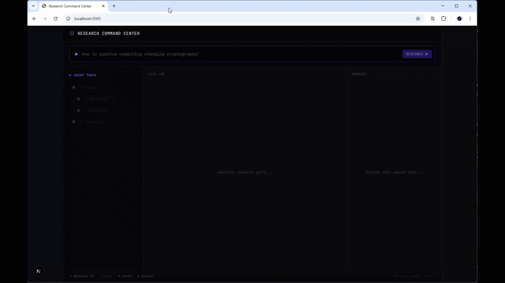

# AI Research Command Center

## Elevator Pitch

A full-stack web application where a user submits a research question and a multi-agent system autonomously plans, searches, retrieves, summarizes, and synthesizes a structured report - with every agent step streamed live to a unique terminal-meets-dashboard UI.



**Demo query:**

> "What is the future of AI agents in healthcare?"

---

## Repositories

|             | Link                                                                                                |
| ----------- | --------------------------------------------------------------------------------------------------- |
| Main (this) | [portfolio-research-agent](https://github.com/alpha5611331/portfolio-research-agent)                   |
| Backend     | [portfolio-research-agent-backend](https://github.com/alpha5611331/portfolio-research-agent-backend)   |
| Frontend    | [portfolio-research-agent-frontend](https://github.com/alpha5611331/portfolio-research-agent-frontend) |

---

## Portfolio Goals

This project is designed to demonstrate the following skills simultaneously:

| Domain          | Skills Demonstrated                                                         |
| --------------- | --------------------------------------------------------------------------- |
| Agentic AI      | LangGraph StateGraph, multi-agent orchestration, tool use, streaming events |
| Backend         | FastAPI, async Python, WebSocket streaming, REST API design                 |
| Frontend        | Next.js 14 App Router, TypeScript, real-time UI, state management           |
| LLM integration | OpenAI SDK-compatible (OpenAI + Groq), prompt engineering, streaming        |
| Search          | Tavily API (free tier), result ranking and deduplication                    |
| UI/UX           | Unique dark command-center design, live agent trace visualization           |
| DevOps          | Docker Compose, environment config,`.env` management                      |

---

## System Architecture

```
User Query
    │
    ▼
┌──────────────┐      WebSocket / SSE      ┌──────────────────────────┐
│   Next.js    │◄─────────────────────────►│       FastAPI            │
│  Frontend    │                           │                          │
│              │   REST (submit query)     │  ┌────────────────────┐  │
│  Command Bar │──────────────────────────►│  │  Agent Orchestrator│  │
│  Agent Trace │                           │  │   (LangGraph)      │  │
│  Log Stream  │◄── real-time event stream─│  └────────┬───────────┘  │
│  Report View │                           │           │              │
│  Sources     │                           │  ┌────────▼───────────┐  │
└──────────────┘                           │  │   Planner Agent    │  │
                                           │  │  (breaks subtopics)│  │
                                           │  └────────┬───────────┘  │
                                           │           │              │
                                           │  ┌────────▼───────────┐  │
                                           │  │  Researcher Agents │  │
                                           │  │  (parallel per     │  │
                                           │  │   subtopic)        │  │
                                           │  │  ┌──────────────┐  │  │
                                           │  │  │ Tavily Search│  │  │
                                           │  │  └──────────────┘  │  │
                                           │  └────────┬───────────┘  │
                                           │           │              │
                                           │  ┌────────▼───────────┐  │
                                           │  │  Summarizer Agent  │  │
                                           │  └────────┬───────────┘  │
                                           │           │              │
                                           │  ┌────────▼───────────┐  │
                                           │  │ Synthesizer Agent  │  │
                                           │  │ (final report)     │  │
                                           │  └────────────────────┘  │
                                           │                          │
                                           │  OpenAI / Groq SDK       │
                                           └──────────────────────────┘
```

---

## Agentic Framework - LangGraph

The entire agent pipeline is a **LangGraph `StateGraph`**. Each agent is a typed node; edges and conditional routing define execution order. This makes the pipeline inspectable, serializable, and easy to extend without touching orchestration logic.

### Why LangGraph

- **Explicit graph topology** - the planner → researchers → summarizer → synthesizer flow is declared as nodes and edges, not implicit function calls; the graph is the architecture
- **Native parallel fan-out** - LangGraph's `Send` API dynamically spawns one Researcher node per subtopic; results are merged back into shared state automatically via a reducer
- **Built-in streaming** - `.astream_events()` emits granular events for every node entry, node exit, and LLM token; the FastAPI WebSocket handler maps these directly to the frontend event schema with no manual event management
- **State as single source of truth** - a typed `ResearchState` dict flows through the graph carrying query, provider, model, subtopics, sources, summaries, and final report; no hidden side-channels

### Graph Topology

```
START → planner → [Send × N subtopics] → researcher (×N, parallel)
                                              ↓ (merge)
                                          summarizer
                                              ↓
                                          synthesizer → END
```

### Tools (used inside Researcher node)

Each Researcher node binds a LangChain tool to its LLM and runs a tool-calling loop until sources are collected:

- `tavily_search` - web search via Tavily API

### LLM Inside Nodes

Every node reads `provider` and `model` from the shared state and constructs a `ChatOpenAI` client (from `langchain-openai`) on the fly. For Groq, the same class is used with `base_url` pointed at Groq's OpenAI-compatible endpoint - no separate code path for each provider.

### Streaming to Frontend

LangGraph's `.astream_events()` output is consumed by the FastAPI WebSocket handler, which translates each LangGraph event kind into the typed frontend event schema (`PLAN_CREATED`, `SEARCH_DONE`, `SUMMARY_CHUNK`, etc.) before broadcasting over the WebSocket connection.

---

## Backend - FastAPI (Python)

### Agent Pipeline

Four LangGraph nodes run in sequence; Researcher nodes fan out in parallel via `Send`.

#### 1. Planner Agent

- Input: raw user query
- Output: list of 3–5 subtopics with search strategies
- LLM call with structured output (JSON mode)
- Emits `PLAN_CREATED` event

#### 2. Researcher Agent (parallel, one per subtopic)

- **Tavily web search**: fetches top 5 results per subtopic (free tier)
- Deduplicates results by URL
- Emits `SEARCH_DONE`, `SOURCES_COLLECTED` events per subtopic

#### 3. Summarizer Agent

- Summarizes each subtopic's collected sources into a concise section
- Streams partial tokens to frontend
- Emits `SUMMARY_CHUNK` (streaming) and `SUMMARY_DONE` events

#### 4. Synthesizer Agent

- Merges all subtopic summaries into a final structured report
- Sections: Executive Summary, Key Findings, Detailed Analysis, Citations
- Streams final report tokens to frontend
- Emits `REPORT_CHUNK` (streaming) and `REPORT_DONE` events

### LLM Configuration

Uses **OpenAI Python SDK** - compatible with both providers:

```python
# OpenAI
client = openai.AsyncOpenAI(api_key=OPENAI_API_KEY)

# Groq (OpenAI-compatible endpoint)
client = openai.AsyncOpenAI(
    api_key=GROQ_API_KEY,
    base_url="https://api.groq.com/openai/v1"
)
```

User selects provider + model from the UI. Backend reads selection from request payload.

Supported models:

- `gpt-4o-mini` / `gpt-4o` (OpenAI)
- `llama-3.3-70b-versatile` / `llama-3.1-8b-instant` (Groq)

### API Endpoints

```
POST   /api/research          Submit query → returns session_id
GET    /api/research/{id}     Get full session result
GET    /api/sessions          List past sessions
DELETE /api/sessions/{id}     Delete session

WS     /ws/{session_id}       Real-time agent event stream
```

### Event Stream Schema

Every WebSocket message is a typed JSON event:

```json
{
  "event": "PLAN_CREATED | SEARCH_DONE | SOURCES_COLLECTED | SUMMARY_CHUNK | SUMMARY_DONE | REPORT_CHUNK | REPORT_DONE | ERROR",
  "session_id": "uuid",
  "timestamp": "ISO-8601",
  "agent": "planner | researcher | summarizer | synthesizer",
  "subtopic": "optional string",
  "data": {}
}
```

### Tech Stack

- Python 3.11+
- FastAPI + Uvicorn
- LangGraph - agent graph definition, parallel `Send`, state management, `.astream_events()` streaming
- `langchain-openai` - `ChatOpenAI` wrapping OpenAI SDK; Groq via `base_url` override
- `langchain-core` - `@tool` decorator for Tavily tool
- `tavily-python` client
- Pydantic v2 for request/response schemas
- `python-dotenv`

---

## Frontend - Next.js 14

### Design Language: "Research Command Center"

**Not** a standard chat UI. Inspired by:

- IDE terminals (VS Code, Warp)
- Mission control dashboards
- Hacker-aesthetic meets editorial

**Visual identity:**

- Dark base: `#0a0a0f` (near-black with blue undertone)
- Accent: electric indigo `#6366f1` + cyan `#06b6d4`
- Monospace font for log streams and agent traces (JetBrains Mono)
- Serif font for the final report (Playfair Display)
- Subtle animated grid background (CSS only, no canvas)
- Glassmorphism cards with `backdrop-blur` for panels
- Framer Motion for agent node animations and transitions

### Layout

```
┌─────────────────────────────────────────────────────────────────┐
│  HEADER: logo + provider selector (OpenAI / Groq) + model pick  │
├─────────────────────────────────────────────────────────────────┤
│  COMMAND BAR: full-width query input (VS Code palette style)    │
│               [Enter to Research >>]                            │
├──────────────┬──────────────────────────┬───────────────────────┤
│              │                          │                       │
│  AGENT TRACE │   LIVE LOG STREAM        │   SOURCES PANEL       │
│  (left 20%)  │   (center 50%)           │   (right 30%)         │
│              │                          │                       │
│  Visual tree │  Timestamped log lines   │  Source cards:        │
│  of agents   │  with color-coded        │  - title              │
│  and their   │  event types             │  - domain badge       │
│  status:     │                          │  - relevance score    │
│              │  ● PLAN_CREATED          │  - snippet            │
│  ○ Planner   │  ● SEARCH: subtopic 1    │  - [open link]        │
│  ├○ Research │  ● SEARCH: subtopic 2    │                       │
│  ├○ Research │  ● SUMMARY streaming...  │  Expandable per       │
│  └○ Synthsz  │  ● REPORT streaming...   │  subtopic             │
│              │                          │                       │
├──────────────┴──────────────────────────┴───────────────────────┤
│  REPORT PANEL (collapsible, expands below on REPORT_DONE)       │
│  Structured markdown report with section headers, citations     │
│  [Copy] [Export MD] [New Research]                              │
├─────────────────────────────────────────────────────────────────┤
│  SESSION HISTORY (collapsible bottom drawer)                    │
│  Past queries with timestamps - click to reload                 │
└─────────────────────────────────────────────────────────────────┘
```

### Component Breakdown

| Component            | Description                                                                |
| -------------------- | -------------------------------------------------------------------------- |
| `CommandBar`       | Full-width input with animated placeholder cycling through example queries |
| `ProviderSelector` | Dropdown to pick OpenAI or Groq + model within each                        |
| `AgentTraceTree`   | Animated vertical tree, nodes pulse when active, checkmark on done         |
| `LogStream`        | Auto-scrolling terminal-style log with color per event type                |
| `SourcesPanel`     | Tabbed by subtopic, cards with favicon, domain badge, score bar            |
| `ReportViewer`     | Streaming markdown renderer, serif font, section anchors, TOC              |
| `SessionDrawer`    | Bottom slide-up list of past sessions from `/api/sessions`               |
| `StatusBar`        | Footer: current agent, token count, latency                                |

### Real-time Streaming

- WebSocket connection opened immediately on query submit
- `LogStream` appends each event as a formatted line
- `ReportViewer` renders tokens incrementally as `REPORT_CHUNK` events arrive
- Agent nodes in `AgentTraceTree` transition: `idle → active → done → error`

### State Management

- Zustand store: `useResearchStore`
  - `session`, `events[]`, `sources[]`, `reportChunks[]`, `agentStatuses{}`
- No Redux, no prop drilling

### Tech Stack

- Next.js 14 (App Router, TypeScript)
- Tailwind CSS + custom design tokens
- Framer Motion (agent tree animations, panel transitions)
- Zustand (state)
- `react-markdown` + `remark-gfm` (report rendering)
- JetBrains Mono + Playfair Display (Google Fonts)
- `date-fns` (log timestamps)

---

## Environment Variables

```env
# Backend (.env)
OPENAI_API_KEY=sk-...
GROQ_API_KEY=gsk_...
TAVILY_API_KEY=tvly-...
DEFAULT_LLM_PROVIDER=openai
DEFAULT_MODEL=gpt-4o-mini

# Frontend (.env.local)
NEXT_PUBLIC_API_URL=http://localhost:8000
NEXT_PUBLIC_WS_URL=ws://localhost:8000
```

---

## Project Structure

```
1.research-agent/
├── backend/
│   ├── main.py                  # FastAPI app, WebSocket handler, event translator
│   ├── graph.py                 # LangGraph StateGraph definition and compilation
│   ├── state.py                 # ResearchState TypedDict
│   ├── agents/
│   │   ├── planner.py           # LangGraph node: plan subtopics
│   │   ├── researcher.py        # LangGraph node: tool-calling loop (Tavily)
│   │   ├── summarizer.py        # LangGraph node: per-subtopic summary
│   │   └── synthesizer.py       # LangGraph node: final report
│   ├── tools/
│   │   └── tavily_search.py     # @tool: Tavily web search
│   ├── models/
│   │   └── schemas.py           # Pydantic request/response models
│   ├── services/
│   │   └── llm.py               # ChatOpenAI factory (OpenAI + Groq via base_url)
│   └── requirements.txt
├── frontend/
│   ├── app/
│   │   ├── layout.tsx
│   │   ├── page.tsx             # Main research page
│   │   └── api/                 # Next.js route handlers (proxy)
│   ├── components/
│   │   ├── CommandBar.tsx
│   │   ├── ProviderSelector.tsx
│   │   ├── AgentTraceTree.tsx
│   │   ├── LogStream.tsx
│   │   ├── SourcesPanel.tsx
│   │   ├── ReportViewer.tsx
│   │   ├── SessionDrawer.tsx
│   │   └── StatusBar.tsx
│   ├── store/
│   │   └── useResearchStore.ts
│   ├── types/
│   │   └── events.ts
│   └── package.json
├── docker-compose.yml           # backend + frontend
└── workspace.md
```

---

## Scope Notes

- **No authentication** - this is a portfolio demo; any user can submit a query and view past sessions. No login, no user isolation.

---

## Why This Is Strong as a Portfolio Project

1. **Real agentic framework** - uses LangGraph `StateGraph` with typed state, conditional fan-out via `Send`, and built-in streaming; not a hand-rolled loop or "LangGraph-style" approximation
2. **Multi-agent system** - planner → parallel researchers → summarizer → synthesizer; each is a discrete node with a single responsibility
3. **Real full-stack** - async FastAPI backend, React frontend, WebSocket streaming, external APIs
4. **Provider flexibility** - `ChatOpenAI` from `langchain-openai` used as a universal interface; Groq swapped in via `base_url` with zero extra code
5. **Live observability** - LangGraph's `.astream_events()` feeds every node transition and LLM token to the UI in real time; nothing hidden
6. **Unique UI** - command-center design, not a generic chat template; shows frontend design skill alongside AI skill
7. **Free-tier viable** - Tavily free tier + Groq free tier means it runs at zero cost for demos
